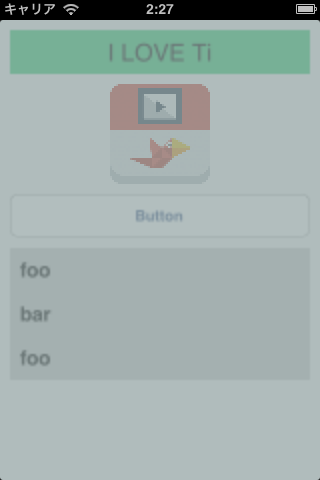

TiGaussianFilterView() {
==================================================
This is a Titanium module for iOS.  
This module supports gaussian filter for TiUIView.  



<a name="TOC">Table of Contents</a>
--------------------------------------------------
1. [Introduction](#Introduction)
1. [Installtion](#Installtion)
1. [Usage](#Usage)
1. [License](#License)

<a name="Introduction">Introduction</a>
------------------------------------------------
This module extends Ti.UI.View class by Category.  
When require this module, new properties are added to Ti.UI.View.  
It is possible to use in any View Component that inherits the TiUIView.  
For example, TiUIButton, TiUIView, TiUITableView, and so on.  

The following are properties that are newly added.  

- `rasterizationScale` : float(ex 0.5)  
Blur degree

- `shouldRasterize` : true or false  
Rasterize the view's layer

- `kCAFilterTrilinear` : true or false  
Set kCAFilterTrilinear to the layer's minificationFilter 

- `kCAFilterNearest` : true or false  
Set kCAFilterNearest to the layer's minificationFilter 

**[[⬆]](#TOC)**

<a name="Installtion">Installation</a>
------------------------------------------------
### Install this module
```javascript
var TiGaussianFilterView = require('net.uchidak.tigfview');
Ti.API.info("module is => " + TiGaussianFilterView);
```

**[[⬆]](#TOC)**

<a name="Usage">Usage</a>
------------------------------------------------
### Gaussian blur view
```javascript
    var b = Ti.UI.createButton({
        top : 10,
        left : 10,
        width : 300,
        height : 60,
        title : 'button',
        rasterizationScale : 0.5,
        shouldRasterize : true,
        kCAFilterTrilinear : true,
    });
```

### Mosaic view
```javascript
    var b = Ti.UI.createButton({
        top : 10,
        left : 10,
        width : 300,
        height : 60,
        title : 'button',
        rasterizationScale : 0.5,
        shouldRasterize : true,
        kCAFilterTrilinear : true,
        kCAFilterNearest : true
    });
```

**[[⬆]](#TOC)**

<a name="Thanks">Thanks:)</a>
------------------------------------------------
[iosjp.com](http://www.iosjp.com/dev/archives/759 "iosjp.com")

**[[⬆]](#TOC)**
 
<a name="License">License and Credit</a>
------------------------------------------------
TiGaussianFilterView  

The MIT License (MIT)

Copyright (c) 2013 Keisuke Uchida

Permission is hereby granted, free of charge, to any person obtaining a copy
of this software and associated documentation files (the "Software"), to deal
in the Software without restriction, including without limitation the rights
to use, copy, modify, merge, publish, distribute, sublicense, and/or sell
copies of the Software, and to permit persons to whom the Software is
furnished to do so, subject to the following conditions:

The above copyright notice and this permission notice shall be included in
all copies or substantial portions of the Software.

THE SOFTWARE IS PROVIDED "AS IS", WITHOUT WARRANTY OF ANY KIND, EXPRESS OR
IMPLIED, INCLUDING BUT NOT LIMITED TO THE WARRANTIES OF MERCHANTABILITY,
FITNESS FOR A PARTICULAR PURPOSE AND NONINFRINGEMENT. IN NO EVENT SHALL THE
AUTHORS OR COPYRIGHT HOLDERS BE LIABLE FOR ANY CLAIM, DAMAGES OR OTHER
LIABILITY, WHETHER IN AN ACTION OF CONTRACT, TORT OR OTHERWISE, ARISING FROM,
OUT OF OR IN CONNECTION WITH THE SOFTWARE OR THE USE OR OTHER DEALINGS IN
THE SOFTWARE.

**[[⬆]](#TOC)**

};
==================================================
© 2013 [Keisuke Uchida](http://uchidak.net) All rights reserved.